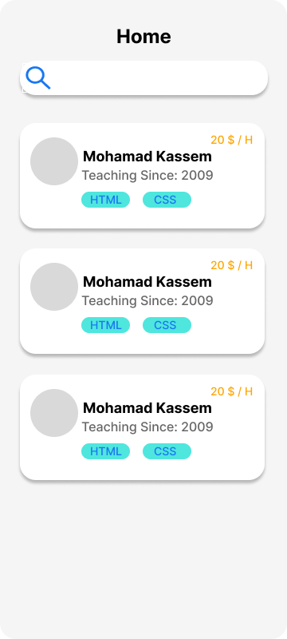
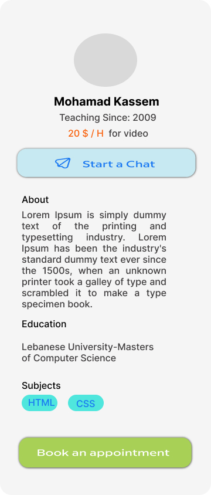
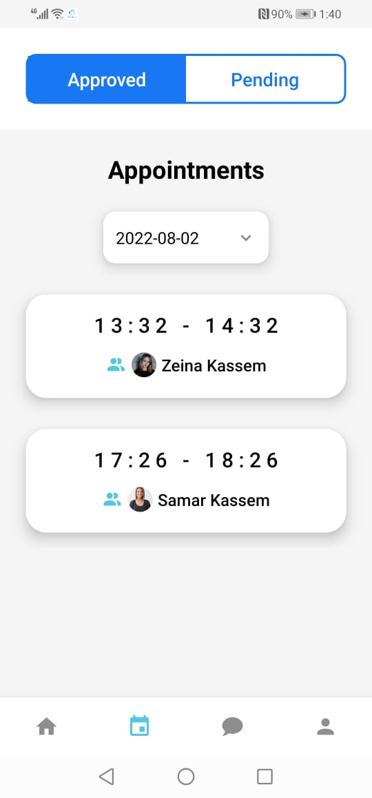
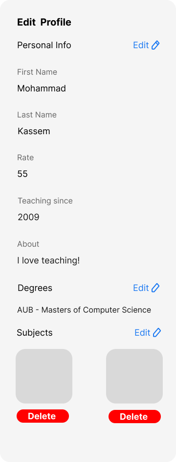
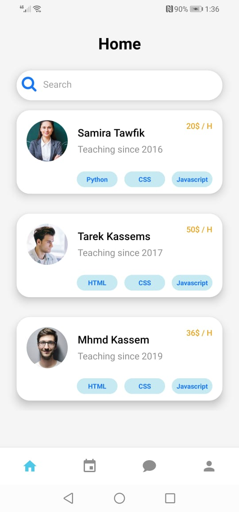
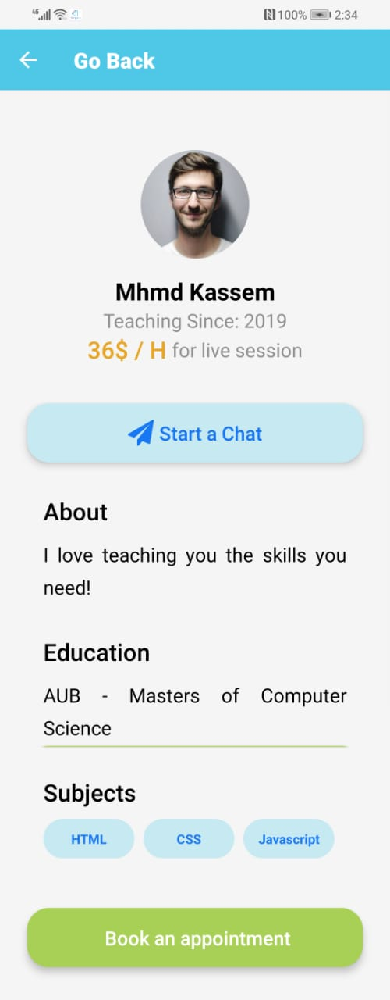
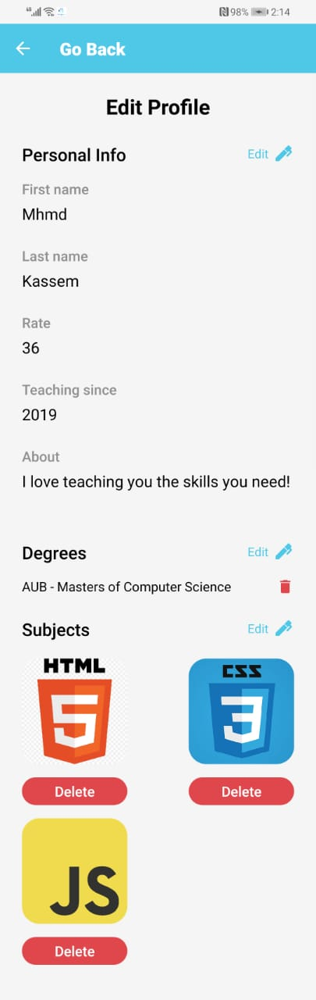

<div align="center">

> Hello world! This is the project’s summary that describes the project plain and simple, limited to the space available. 


**[PROJECT PHILOSOPHY](https://github.com/mohammad-kassem/comptutor-final-project.git) • [WIREFRAMES](https://github.com/mohammad-kassem/comptutor-final-project.git) • [TECH STACK](https://github.com/mohammad-kassem/comptutor-final-project.git) • [IMPLEMENTATION](https://github.com/mohammad-kassem/comptutor-final-project.git) • [HOW TO RUN?](https://github.com/mohammad-kassem/comptutor-final-project.git)**

</div>

<br><br>


> Comptutor is a mobile application that connects students with tutors. It is a fully digital online tutoring experinece where appointments are managed between students and tutors for live sessions. Tutors and students are connected based on their subjects of choice. Tutors and students are connected through a chatting system.

> Comptutor, your tutor on your computer.

### User Stories
- As a student, I want to be see tutors that teach the subjects I am intrested in learning.
- As a student, I want to be able to view tutor's available times to book a live session.
- As a student, I want to have the option to send my questions to the tutors.
- As a tutor, I want to be contacted only by students concerning my subjects.
- As a tutor, I want to be able to add my available times to be viewed by students.
- As a tutor, I want students to be able to contact me.

<br><br>


> This design was planned before on paper, then moved to Figma app for the fine details.
Note that i didn't use any styling library or theme, all from scratch and using pure css modules

| Home  | Tutor  | Appointments | Profile
| -----------------| -----------------| -----------------| -----------------|
|  |  |  | 


<br><br>


Here's a brief high-level overview of the tech stack the Well app uses:

- This project uses the [React Native app development framework](https://reactnative.dev/). React Native is an open-source UI software framework created by Meta Platforms, Inc. It is used to develop applications for Android, Android TV, iOS, macOS, tvOS, Web, Windows and UWP by enabling developers to use the React framework along with native platform capabilities.
- This project uses the [Laravel web application framework](https://laravel.com/). Laravel is a free and open-source PHP web framework intended for the development of web applications following the model–view–controller architectural pattern 
- For persistent storage (database), the app uses [MySQL](https://www.mysql.com/) which is an open-source relational database management system that uses the Structured Query Language.
- This project uses Google Firebase services for real-time events.


<br><br>


> Using the above mentioned tech stacks and the wireframes build with figma from the user stories we have, the implementation of the app is shown as below, these are screenshots from the real app

| Home  | Tutor  | Appointments | Profile
| -----------------| -----------------| -----------------| -----------------|
|  |  |  | 


<br><br>


> To get a local copy up and running follow these simple example steps.

### Prerequisites
* npm
  ```sh
  npm install npm@latest -g
  ```
* install Node.js
  ```sh
  download https://nodejs.org/en/download/
  ```


### Installation

1. Clone the repo
   ```sh
   git clone https://github.com/mohammad-kassem/comptutor-final-project.git
   ```
2. Install NPM packages
   ```sh
   npm install
   ```
3. expo cli
   ```sh
   npm install --global expo-cli
   ```
4. expo start
   ```sh
   expo start
   ```


