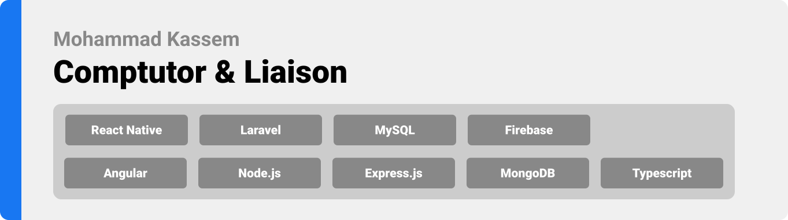

<div align="center">

> Hello world! This is the project’s summary that describes the project plain and simple, limited to the space available. 


**[PROJECT PHILOSOPHY](https://github.com/mohammad-kassem/comptutor-final-project#project-philosophy) • [WIREFRAMES](https://github.com/mohammad-kassem/comptutor-final-project#wireframes) • [TECH STACK](https://github.com/mohammad-kassem/comptutor-final-project#tech-stack) • [IMPLEMENTATION](https://github.com/mohammad-kassem/comptutor-final-project#implementation) • [HOW TO RUN?](https://github.com/mohammad-kassem/comptutor-final-project#run)**

</div>

<br><br>


> Comptutor is a mobile application that connects students with tutors. It is a fully digital online tutoring experinece where appointments are managed between students and tutors for live sessions. Tutors and students are connected based on their subjects of choice. Tutors and students are connected through a chatting system. Students and tutors are notifed with appointment updates through push notifications.

> Comptutor, your tutor on your computer.

### Student Stories
- As a student, I want to be able to see tutors that teach the subjects I am intrested in learning.
- As a student, I want to be able to search for the tutor I have in mind.
- As a student, I want to be able to search tutors by subjects.
- As a student, I want to be able to view a tutor's available times to book a live session.
- As a student, I want to be notified when my appointment with the tutor is approved.
- As a student, I want the freedom to cancel an appointment.
- As a student, I want to be a specific cutoff period after which the other party cannot cancel the appointment.
- As a student, I want to have the option to send my questions to the tutors.
- As a student, I want to have the option to update my information and subjects I want to learn. 


### Tutor Stories
- As a tutor, I want to be contacted only by students concerning my subjects.
- As a tutor, I want appointments to be booked according to my available times.
- As a tutor, I want to be notified when someone requests an appointment.
- As a tutor, I want to be able to accept or reject appointments requests.
- As a tutor, I want the freedom to cancel an appointment.
- As a tutor, I want to be a specific cutoff period after which the other party cannot cancel the appointment.
- As a tutor, I want students to be able to connect with me easily.
- As a tutor, I want to have the option to update my information, add my education, and subjects I teach. 


<br><br>


> This design was planned on the Figma app.

| Login  | Register  | Add Subjects  | Add Degrees  |
| -----------------| -----------------| -----------------| -----------------|
|  |  |  | 

| Home  | Tutor Page | Profile  | Edit Profile |
| -----------------| -----------------| -----------------| -----------------|
|  |  |  | 

| Schedules  | Tutor Appointments  | Chat Rooms  |  Email Verification  |
| -----------------| -----------------| -----------------| -----------------|
|  |  |  |  


Here's a brief high-level overview of the tech stack that Comptutor uses:

- This project uses the [React Native app development framework](https://reactnative.dev/). React Native is an open-source UI software framework created by Meta Platforms, Inc. It is used to develop applications for Android, Android TV, iOS, macOS, tvOS, Web, Windows and UWP by enabling developers to use the React framework along with native platform capabilities.
- This project uses the [Laravel web application framework](https://laravel.com/). Laravel is a free and open-source PHP web framework intended for the development of web applications following the model–view–controller architectural pattern 
- For persistent storage (database), the app uses [MySQL](https://www.mysql.com/) which is an open-source relational database management system that uses the Structured Query Language.
- This project uses Google Firebase services for real-time events [Firebase](https://firebase.google.com/). Firebase is a platform developed by Google for creating mobile and web applications.


<br><br>


> As a showcase of the app's successful implementation  sing the above mentioned tech stacks, the animations of the main functionalities of the app are shown below:

| Splash Screen | Login  | Login Validation  |
| -----------------| -----------------| -----------------|
|  |  | 

| Register  | Register Validation  | Email Verification  |
| -----------------| -----------------| -----------------|
|  | | 


| Tutor Subjects  | Tutor Degree  | Tutor Info   |
| -----------------| -----------------| -----------------|
|  |  | 

| Tutor Screen | Search  | Unread chats |
| -----------------| -----------------|-----------------|
|  |  |  |

| Student Chat Start  |  Tutor Chat   |  Student Chat   |
| -----------------| -----------------| -----------------|
|  |   | 

| Add Schedule  | Schedules Clashing  |  Display Schedules   |
| -----------------| -----------------| -----------------|
|  |  | 

| Book Appointmnet Tutor  | Book Appointmnet Student  | Approve Appointmnet Tutor  |
| -----------------| -----------------|-----------------|
|  |  | 

| Approve Appointmnet Student  | Cancel Appointmnet Tutor  | Cancel Appointmnet Student  |
| -----------------| -----------------| -----------------|
|  |  | 


| Video Call Start  | Video Call Responsiveness  | Video Call Camera Off  |
| -----------------| -----------------| -----------------|
|  |  |  

| Video Call Leave  | Edit Info  | Edit Subjects|
| -----------------| -----------------| -----------------|
|   |  | 

| Edit Image  | Image real-time Update  | Info real-time Update |
| -----------------| -----------------| -----------------|
|  |  |  |


<br><br>


> To get a local copy up and running follow these simple example steps.

### Prerequisites
* npm
  ```sh
  npm install npm@latest -g
  ```
* install Node.js
  ```sh
  download https://nodejs.org/en/download/
  ```


### Installation

1. Clone the repo
   ```sh
   git clone https://github.com/mohammad-kassem/comptutor-final-project.git
   ```
2. Install NPM packages
   ```sh
   npm install
   ```
3. expo cli
   ```sh
   npm install --global expo-cli
   ```
4. expo start
   ```sh
   expo start
   ```


